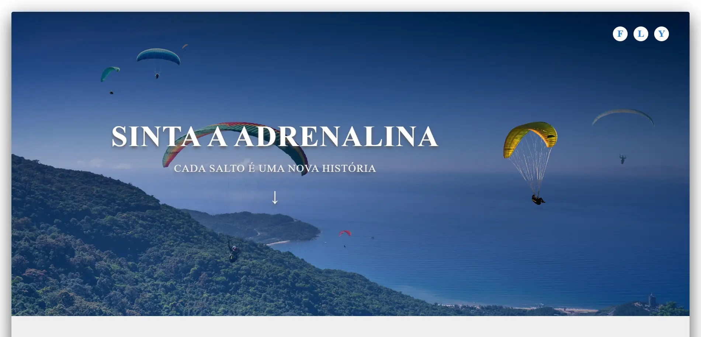

<h1 align="center"> FLY </h1>

FLY agência de paraquedismo. 

  <a href="#-tecnologias">Tecnologias</a>&nbsp;&nbsp;&nbsp;|&nbsp;&nbsp;&nbsp;
  <a href="#-projeto">Projeto</a>&nbsp;&nbsp;&nbsp;

 

  

## 🌐 Tecnologias

Esse projeto foi desenvolvido com as seguintes tecnologias:

- Nextjs
- CSS3

## 💻 Projeto

O FLY é um website de uma agência fictícia de paraquedismo, criado para prática pessoal em Nextjs.

- [Acesse o projeto finalizado](https://fly-agency.vercel.app/)

---

Enjoy 🚀